<p align="center">
  
</p>


# Tópicos

- [Ideia geral de login e controle de acesso](#ideia-geral-de-login-e-controle-de-acesso)
- [Visão geral OAuth2](#visão-geral-oauth2)
- [Login, credenciais e JWT](#login-credenciais-e-jwt)
  - [Aplicativo](#aplicativo)
  - [Usuário](#usuário)


[JWT](#jwt)
- 
  - [Estrutura](#estrutura)
  - [Como funciona](#como-funciona)
  - [Vantagens](#vantagens)

<hr>

[Inserindo OAuth2 e JWT em projeto](#inserindo-oauth2-e-jwt-em-um-projeto)
- 
  - [Modelo de dados User-Role](#modelo-de-dados-user-role)
  - [Adicionando Spring Security ao projeto](#adicionando-spring-security-ao-projeto)
    - [Liberando endpoints Spring Security](#liberando-endpoint-spring-security)
    - [Liberando H2 Spring Security](#liberando-h2-spring-security)
  - [BCrypt password enconder](#bcrypt-password-enconder)
  - [CheckList Spring Security](#implementando-checklist-spring-security)
<hr>

[Checklist OAuth2 JWT password grant](#checklist-oauth2-jwt-password-grant-1)
-
- [Valores Config (inserir app.properties)](#valores-de-configuração-inserir-no-applicationproperties)
- [Maven](#maven)
- [Checklist - password grant](#checklist-oauth2-jwt-password-grant-2)

<hr>


# Objetivo

Aqui, implementaremos esquema de login e controle de acesso. O usuário irá informar as suas credenciais, receberá um token
de acesso e com esse token ele vai acessar os recursos que estão protegidos no sistema.

Teremos controle por perfil de usuário. Ou seja, alguns end points serão liberados para o público, outros para clientes
e outros para administratores (que poderá fazer tudo).

## Requisitos projeto

Todas as premissas e o sumário com o que deve ser feito está no "Documento de Requesitos DSCommerce.pdf".
Como é algo específico do curso, não colocarei o link, mas você pode adquirir no site [devsuperior]().

## UML

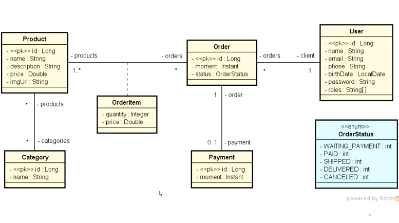

## Ideia geral de login e controle de acesso

Em algum momento o usuário vai fazer o seu login, ou seja, irá informar as suas credenciais (email ou id/senha).

Depois disso, o sistema retorna para o usuário um token de acesso.

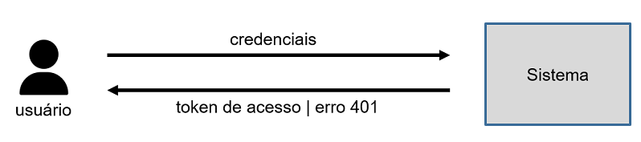

Um token de acesso é um pedaço de uma string que será usado para autorizar esse usuário a acessar alguns recursos.
Isso é muito usado hoje em dia, pois atualmente o backend é separado fisicamente do frontend, então é uma boa estratégia
manter o token (um controle de acesso), sem precisar armazenar estado dentro do banco de dados (quem está logado ou não).

❗Caso não seja aprovado, como pode ser visto na imagem acima, será retornado um erro 401.
<hr>
O token de acesso sendo concedido, a nossa aplicação enviará as próximas requisições usando este token.

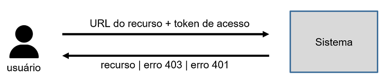

A partir dessa tentativa de conectar a um recurso específico (cliente ou adm), o backend irá analisar se o token é valido,
o perfil do usuário. Após isso, ele irá ou devolver o recurso para o usuário, ou:

- um erro 401 - quando o token informado for inválido, ou seja, dado corrompido ou tempo expirado.
- um erro 403 - usuário tenta informar o recurso, o token É VALIDO, mas o perfil do usuário não pode acessar o recurso,
(como uma área administrativa, por exemplo).

## Visão geral OAuth2

https://oauth.net/2/

Uma forma de implementar o login (controle de acesso) aos recursos da aplicação.

OAuth2 é um protocolo padrão para autorização. **Mas como funciona na prática?**

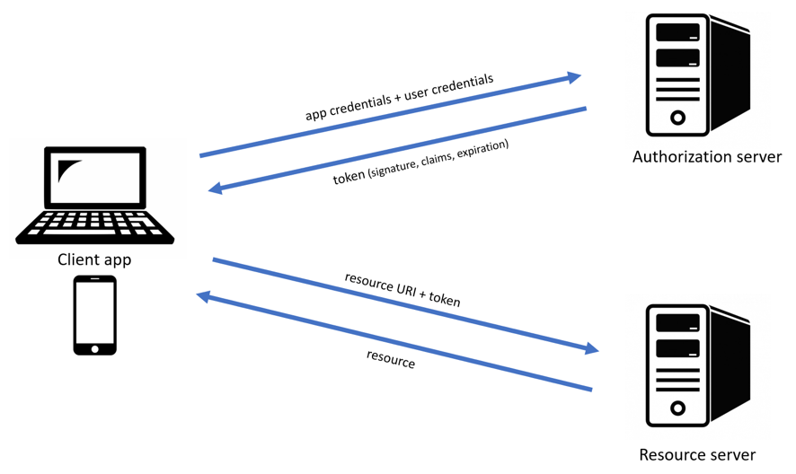

Na imagem acima podemos observar um cliente acessando o sistema backend informando as credenciais e recebendo um token
para login.

Depois, informarmos nosso token + URL do recurso onde recebemos de volta o mesmo.

Mas é bacana observar que o OAuth2 separa essas etapas, delegando-as para servidores específicos. Um responsável para
autorização e outro para verificar se o usuário tem direito a acessar tais recursos.

Cada coisa dessa imagem acima (app e user credentials, signature token, claims e mais), veremos nos tópicos abaixo.

## Login, credenciais e JWT

Aqui falaremos do login (informar credenciais) para pegar o token.

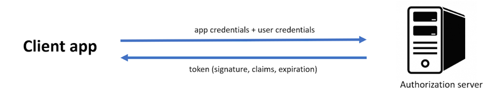

Repare na imagem que temos dois tipos de credenciais: de usuário e aplicativo.

### Aplicativo

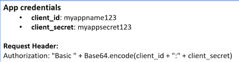

Os dados (id e secret do cliente), são passados na requisição através da request header (o cabeçalho, chamado 
authorization).

Base64 é basicamente algo para "bagunçar", os dados, para nada ficar exposto na requisição.
<hr>

### Usuário

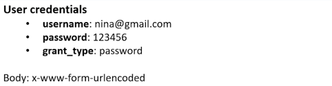

Na parte de usuário, precisamos passar na requisição o "grant_type", ou seja, o tipo de autenticação. Neste caso, é
password.
<hr>

Tudo isso nos dará a resposta, ou seja: **O token**!

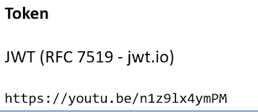

O token não tem um formato específico, a gente coloca o que for melhor para a aplicação. Nós utilizaremos o formato
JWT, um formato padrão das indústrias, veja abaixo:

## JWT

[Jwt.io](https://jwt.io)

[Introdução a JWT - Nélio Alves](https://www.youtube.com/watch?v=n1z9lx4ymPM)

JWTs são amplamente utilizados em aplicações web modernas, especialmente para autenticação e controle de acesso em APIs.

Ele tem um padrão aberto (RFC 7519) que define um método compacto e autônomo para transmitir informações seguras entre 
partes como um objeto JSON. Esses tokens são frequentemente usados p**ara autenticação e troca de informações em 
sistemas distribuídos.**

### Estrutura

O JWT é dividido em 3 partes:

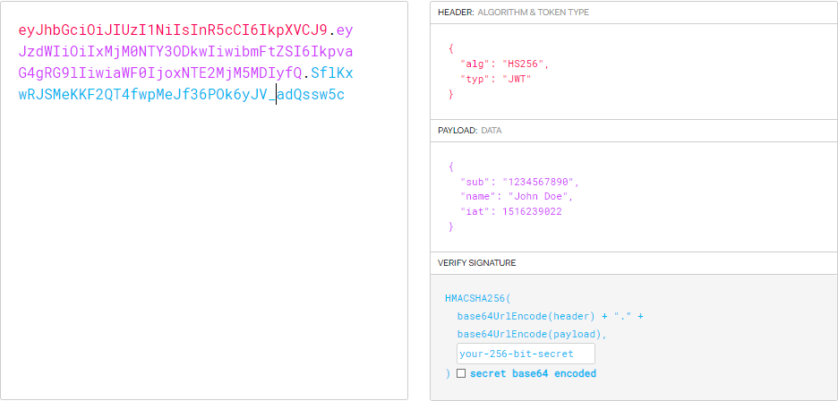

1. Cabeçalho (vermelho) (Header): Geralmente indica o tipo de token (JWT) e o algoritmo de assinatura usado 
(como HMAC SHA256 ou RSA).


3. Corpo (roxo) (Payload): Contém as declarações (claims), que são as informações que você quer transmitir. Existem 
três tipos de declarações: 
   1. registradas (como iss para emissor, exp para expiração);
   2. públicas;
   3. privadas.
   

4. Assinatura (azul) (Signature): Usada para verificar se o emissor do token é quem diz ser e se o token não foi 
alterado. É criada combinando o cabeçalho e o corpo do token com uma chave secreta ou uma chave privada.

### Como funciona

1. O servidor gera um JWT após a autenticação do usuário e o envia ao cliente.


2. O cliente armazena o token (geralmente em armazenamento local ou cookies) e o envia com cada solicitação subsequente.


3. O servidor pode verificar a validade do token e, se válido, autoriza o acesso com base nas informações contidas 
no payload.

### Vantagens

1. Compacto: JWTs são compactos, o que facilita a transmissão em URLs, parâmetros de consulta ou headers HTTP.


2. Autônomo: Contém todas as informações necessárias para a verificação de autenticidade, reduzindo a necessidade 
de verificar o estado do servidor.


3. Segurança: Pode ser assinado (para garantir a integridade dos dados) e criptografado (para garantir a privacidade).

## Inserindo OAuth2 e JWT em um projeto

[Repositório de referência](https://github.com/devsuperior/spring-boot-oauth2-jwt-demo)

❗Lembrar de configurar o enviroment do Postman importando a collection e enviroment. (Trocar porta 8081 do ashost 
para 8080)

### Modelo de dados User-Role

Para implementarmos a segurança na aplicação, juntamente com controle de acesso por perfis de usuário, precisamos
implementar os modelos de dados para armazenar esses perfis.

**UML** - Relação Many to Many

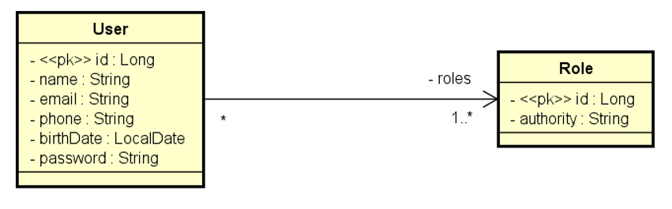

Email será usado para login.

A tabela Role é o **perfil do usuário** (cliente, admin, operador, etc...).

1. Criar entidade Role;
2. Construtor, getters and setters e equals&hashcode com authority;
3. Implementar anotações Spring e fazer a relação ManyToMany com User;
4. Na classe User, criar um método void "addRole";
5. Criar um método hasRole, passando uma Role para retornar true ou false;
   - Para isso, só fazer um for na Lista Role para verificar igualdade.

### Adicionando Spring Security ao projeto

Maven Spring Security

```xml
<dependency>
    <groupId>org.springframework.boot</groupId>
    <artifactId>spring-boot-starter-security</artifactId>
</dependency>

<dependency>
    <groupId>org.springframework.security</groupId>
    <artifactId>spring-security-test</artifactId>
    <scope>test</scope>
</dependency>
```

#### Liberando endpoint Spring Security

Se adicionarmos o Spring Security e rodar a aplicação, os nossos endpoints estarão bloqueados.

Para liberá-los provisioriamente, criaremos uma classe SecurityConfig no pacote config:

```java
@Configuration
public class SecurityConfig {

	@Bean
	public SecurityFilterChain filterChain(HttpSecurity http) throws Exception {
        
        //acessando o objeto HttpSecurity e desabilitando a proteção contra ataques do tipo csrf
        //(quando gravamos dados na sessao).
		http.csrf(csrf -> csrf.disable());
        
        //autorizando qualquer tipo de request http
		http.authorizeHttpRequests(auth -> auth.anyRequest().permitAll());
		return http.build();
	}
}
```

#### Liberando H2 Spring Security

```java
@Configuration
public class SecurityConfig {
    @Bean
    @Profile("test")
    @Order(1)
    public SecurityFilterChain h2SecurityFilterChain(HttpSecurity http) throws Exception {

        http.securityMatcher(PathRequest.toH2Console()).csrf(csrf -> csrf.disable())
                .headers(headers -> headers.frameOptions(frameOptions -> frameOptions.disable()));
        return http.build();
    }
}
```


### BCrypt password enconder

Aqui codificaremos a nossa senha, pois não é bacana a gente colocar no banco a senha do usuário direto. A ideia é
codificá-la para um codigo hash, gerado a partir da senha.

Na classe Config criada anteriormente, podemos definir componentes na forma de métodos. 

1. Criaremos um componente chamado passwordEncoder, usando o Bcrypt e @Bean;
2. Assim que dermos o ``return``, esse objeto virará um componente que pode ser injetado em outros lugares;
3. Para testar, injetaremos ele no nosso Application.


```java
@Configuration
public class SecurityConfig {
    @Bean
    public PasswordEncoder getPasswordEncoder() {
        return new BcryptPasswordEncoder();
    }
}
```

```java
@SpringBootApplication
public class DemoApplication implements CommandLineRunner {
    @Autowired
    private PasswordEnconder passwordEnconder;
    
    @Override
    public void run(String... args) throws Exception {
        //para gerar o codigo hash 
        System.out.println(passwordEnconder.enconde("123456"));
        
        //para comparar o codigo hash gerado com a senha
        boolean result = passwordEnconder.matches("123456", "insira hash aqui")
    }
}
```

Código hash gerado para substituir a senha:


### Implementando checkList Spring Security

O Spring Security é um sub framework responsável por fazer a parte de segurança/autenticar usuários.

Para que ele possa fazer isso e o nosso projeto tenha o mecanismo de identificar os usuários e os seus perfis 
usando o framework, precisamos implementar algumas interfaces para que o Security as use, veja:

UserDetails - Tem as informações do usuário. Repare, nós possuímos o ``getAuthorities`` que, na verdade, é uma coleção
da interface GrantedAuthority do lado.

GrantedAuthority - É onde as roles do usuário ficarão guardadas.

UserDetailsService - Passaremos um nome de usuário e será retornado um UserDetails.

E uma exceção para caso o usuário não seja encontrado.

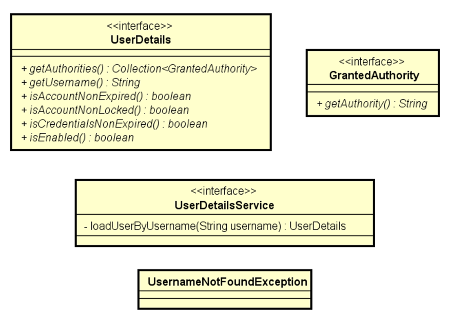

#### Entidades que herdarão as interfaces

Os métodos serão implementados automaticamente.

Role ⇛ GrantedAuthority

User ⇛ UserDetails (lembrar de colocar os retornos nos métodos, se o email é o UserName, colocar o retorno etc)

UserService ⇛ UserDetailsService

Uma breve introdução.
-

O método do UserDetailsService é tentar encontrar um usuário por Username. Como nosso Username na verdade é o email,
precisamos:

1. Criar um UserRepository com o método "findByEmail". Como já sabemos, o Repository consegue realizar a busca em
virtude do "by". Para que ele consiga também buscar as roles desse usuário, faremos uma consulta SQL raíz.

Nesse ponto, nós já sabemos!
- Criar uma UserDetailsProjection no pacote projections, com os atributos em get:
```java
public interface UserDetailsProjection {

	String getUsername();
	String getPassword();
	Long getRoleId();
	String getAuthority();
}
```

- Fazer a consulta no UserRepository, usando o projection com o SQL

```java
@Query(nativeQuery = true, value = """
			SELECT tb_user.email AS username, tb_user.password, tb_role.id AS roleId, tb_role.authority
			FROM tb_user
			INNER JOIN tb_user_role ON tb_user.id = tb_user_role.user_id
			INNER JOIN tb_role ON tb_role.id = tb_user_role.role_id
			WHERE tb_user.email = :email
		""")
List<UserDetailsProjection> searchUserAndRolesByEmail(String email);

```

2. Injetar esse Repository no UserService, e utilizá-lo dentro do método advindo da interface:

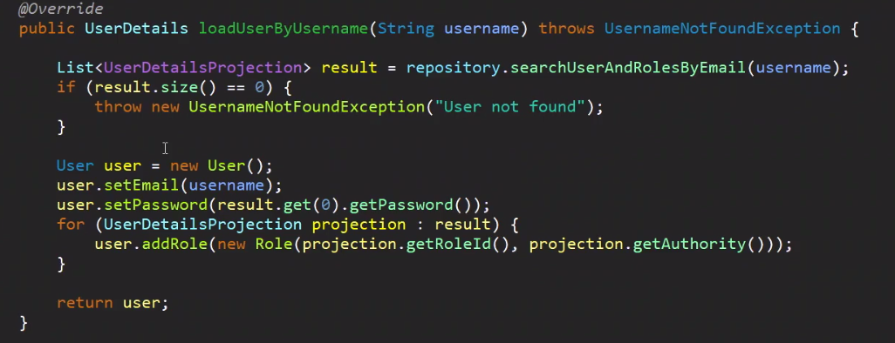

1. Criaremos uma lista do tipo projection e usamos o método do repository passando o username;
2. Se ela estiver vazia, lançamos a exceção;
3. Caso contrário, instanciaremos um User, setaremos o seu email e password;
4. Para settar as roles, faremos um for:
   - Para cada Projection dentro da lista result, entraremos no objeto user e utilizaremos o método addRole;
   - Dentro dele, criaremos um new Role, passando o roleid e tipo de authority :)
7. Retorna o user depois.

### Checklist OAuth2 JWT password grant

#### Valores de configuração (inserir no application.properties)
```
security.client-id=${CLIENT_ID:myclientid}
security.client-secret=${CLIENT_SECRET:myclientsecret}

//duracao token 
security.jwt.duration=${JWT_DURATION:86400}

cors.origins=${CORS_ORIGINS:http://localhost:3000,http://localhost:5173}
```

#### Maven
```xml
<dependency>
    <groupId>org.springframework.security</groupId>
    <artifactId>spring-security-oauth2-authorization-server</artifactId>
</dependency>

<dependency>
    <groupId>org.springframework.boot</groupId>
    <artifactId>spring-boot-starter-oauth2-resource-server</artifactId>
</dependency>
```

#### Checklist OAuth2 JWT password grant

Acessar [este](https://github.com/devsuperior/spring-boot-oauth2-jwt-demo) repositório.

password grant ⇛ spring-boot 3-1-0 ⇛ entrar nas subpastas até achar a config e selecionar:
```AuthorizationServerConfig.java``` e ```ResourceServerConfig.java```.

1. Inserir na pasta de config do projeto, apagando o SecurityConfig, não será mais necessário.


2. Criar um subpacote em config chamado "customgrant". Dentro dele, teremos classes auxiliares para configurar o password
grant do OAuth2 (o token que pegamos passando as credenciais).

No path acima, entra na pasta customgrant e pega os arquivos e joga no subpacote criado no nosso projeto.

- [ ] Implementação customizada do password grant
- [ ] Authorization server
  - [ ] Habilitar Authorization server
  - [ ] Configurar token (codificação, formato, assinatura)
  - [ ] Configurar autenticação / password encoder
  - [ ] Registrar aplicação cliente
  

- [ ] Resource server
- [ ] Configurar controle de acesso aos recursos
- [ ] Configurar CSRF, CORS
- [ ] Configurar token
- [ ] Liberar H2 Console no modo teste

### Requisição de Login

Aqui, enviaremos as credenciais do app e usuário e esperar de volta um token.

1. Criaremos uma requisição no Postman do tipo POST;
2. Seu caminho será http://localhost:8080/oauth2/token
   - Esse /oauth2/token é disponibilizado pelo próprio Spring
3. No cabeçalho "authorization", passaremos o client id e secret e o base64;
   - Para encondar com o base64 no Postman seu Type será Basic Auth
   
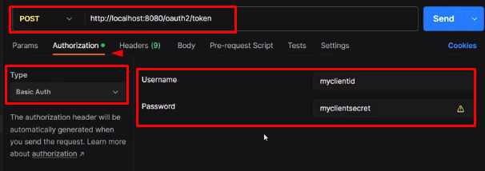

Os campos username e password foram tirados do codigo de application.properties, [veja](#valores-de-configuração-inserir-no-applicationproperties)

A partir disso, se observarmos no header do postman, a query de Authorization ja terá feito ela, exatamente como na diz 
na imagem:

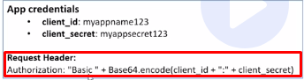

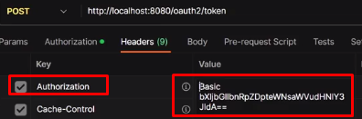

No body do Postman, não teremos um tipo JSON e sim x-www-form-urlencoded, colocaremos chave e valor, veja:

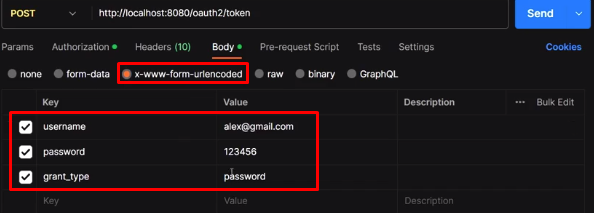

Ao rodar a requisição, será gerado o token de acesso:

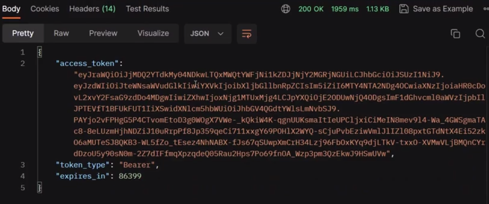